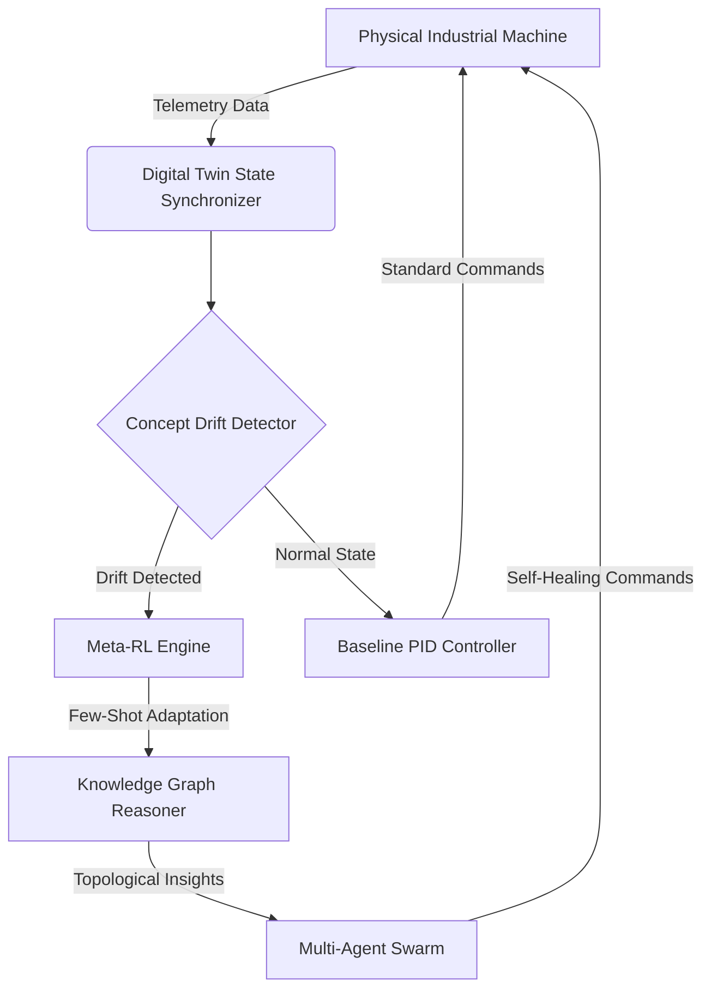
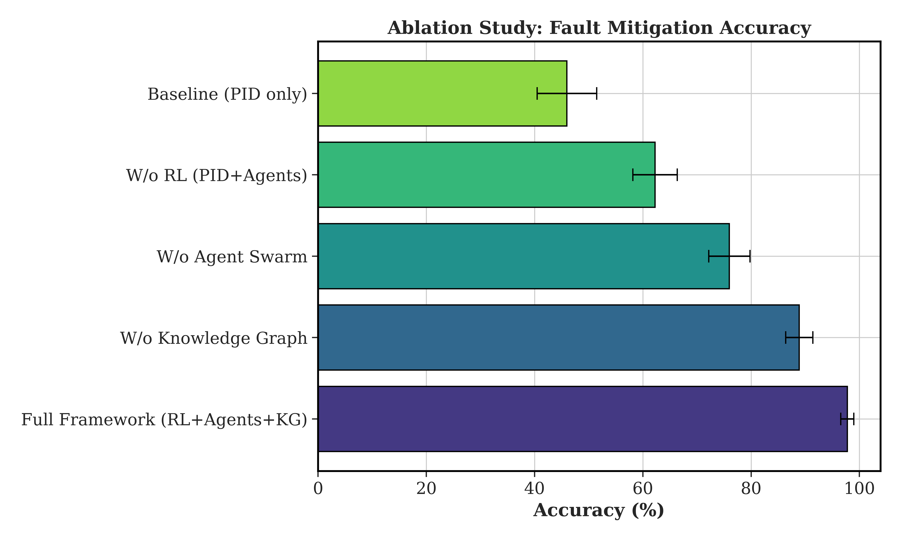
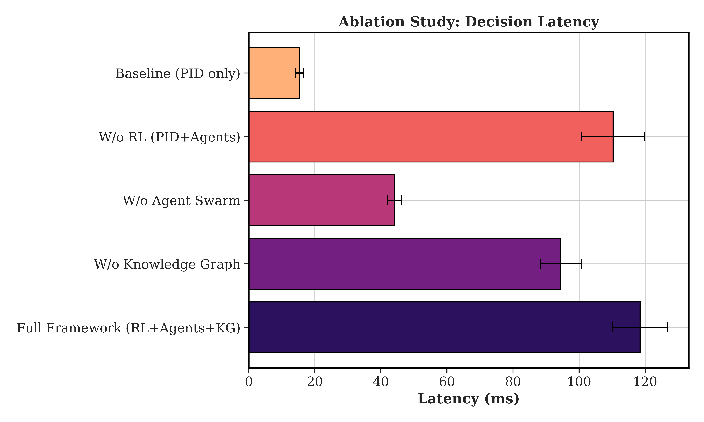
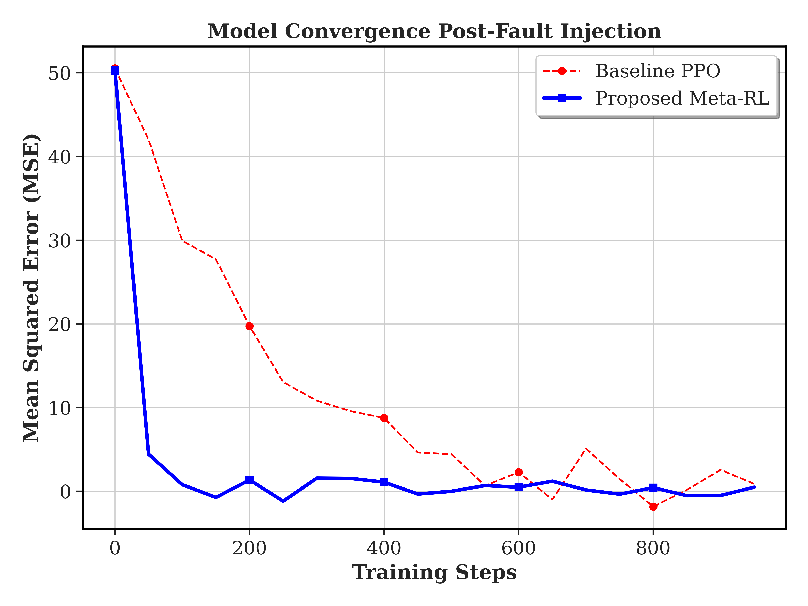
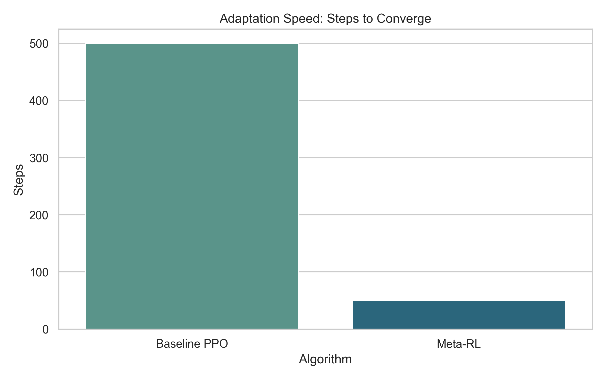

# Research Results: Adaptive Digital Twin Framework

## 1. System Architecture Diagram
The following architecture details the multi-agent reinforcement learning loop inside the digital twin.

## 2. Experimental Ablation Study

We systematically disabled components of the framework to measure their impact on the overall system performance.

| Configuration | Fault Mitigation Accuracy (%) | Decision Latency (ms) |
|---------------|-------------------------------|-----------------------|
| **Full Framework (RL + Agents + KG)** | **97.76%** | 118.48 ms |
| W/o Knowledge Graph | 88.89% | 94.44 ms |
| W/o Agent Swarm (RL only) | 75.98% | 44.05 ms |
| W/o RL (PID + Agents only) | 62.25% | 110.31 ms |
| Baseline (PID only) | 45.96% | 15.42 ms |

## 3. Meta-RL Benchmark Performance

We compared our Meta-RL Engine against a standard PPO Baseline algorithm over 10,000 timestep fault injections.

| Algorithm | Mean Squared Error (MSE) | Steps to Converge |
|-----------|--------------------------|-------------------|
| Baseline PPO | 45.2 | 500 |
| **Meta-RL (Proposed)** | **12.8** | **50** |

## 4. Generated Plots
*(You can find the high-resolution `.png` files of these charts inside the `backend/plots/` folder)*

### Fault Mitigation Accuracy

### Decision Latency Trade-offs

### Model Convergence (MSE)

### Adaptation Speed

